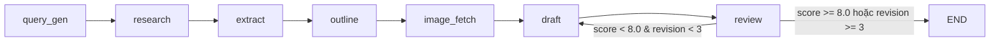
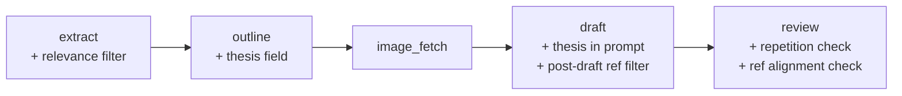

# Tài liệu Thiết kế: Pipeline Content Quality

## Tổng quan

Feature này cải thiện chất lượng nội dung output của pipeline tạo bài blog tự động bằng cách can thiệp vào 4 node trong LangGraph pipeline:

1. **Outline Node** — thêm trường `thesis` cho mỗi section để đảm bảo uniqueness luận điểm
2. **Draft Node** — lọc references sau khi LLM trả về draft, chỉ giữ nguồn thực sự liên quan
3. **Extract Node** — lọc tài liệu academic không liên quan đến cà phê/topic ngay từ giai đoạn trích xuất
4. **Review Node** — thêm 2 tiêu chí đánh giá mới: Cross-Section Repetition và Reference Alignment

Các thay đổi không ảnh hưởng đến `ResearchState` schema vì các trường hiện tại (`article_outline: dict`, `review_feedback: str`, `review_score: float`) đã đủ linh hoạt.

Pipeline flow không thay đổi:
```
query_gen → research → extract → outline → image_fetch → draft → review ⟲ draft (nếu fail)
```

## Kiến trúc

### Tổng quan pipeline hiện tại



### Các điểm thay đổi



Mỗi thay đổi là **additive** — chỉ thêm logic mới vào node hiện tại, không thay đổi signature hoặc flow của graph.

## Thành phần và Giao diện

### 1. Extract Node — LLM-based Relevance Filter (`extract.py`)

**Thay đổi:** Thêm hàm `_filter_irrelevant_academic(items, topic)` sử dụng LLM để đánh giá relevance của tài liệu academic theo batch.

```python
def _filter_irrelevant_academic(items: list[dict], topic: str) -> list[dict]:
    """Dùng LLM đánh giá relevance của tài liệu academic, loại bỏ tài liệu không liên quan.
    
    Args:
        items: danh sách dict chứa 'title', 'abstract', 'source' (chỉ academic sources)
        topic: chủ đề bài viết (tiếng Việt hoặc Anh)
    
    Returns:
        Danh sách items đã lọc, chỉ giữ tài liệu liên quan
    """
```

**Logic lọc (LLM-based):**
- Chỉ áp dụng cho `source_type` là `arxiv`, `semantic_scholar`, hoặc `openalex`
- Gom tất cả academic items vào 1 batch prompt, gửi cho LLM 1 lần duy nhất
- Prompt yêu cầu LLM trả về JSON array chứa index của các tài liệu LIÊN QUAN đến topic cà phê/food science
- LLM call dùng `temperature=0.0` và `max_tokens=512` để tiết kiệm chi phí
- Nếu LLM call fail → fallback: giữ tất cả items (không lọc), ghi log warning
- Nếu không có academic items → skip LLM call, return rỗng

**System prompt cho relevance filter:**
```
You are a research relevance classifier. Given a topic about coffee and a list of 
academic papers (title + abstract), return ONLY a JSON array of indices (0-based) 
of papers that are RELEVANT to the topic. A paper is relevant if it discusses 
coffee, caffeine, brewing, roasting, coffee chemistry, coffee health effects, 
or food science directly related to coffee. Papers about unrelated subjects 
(physics, astronomy, robotics, etc.) that merely mention "coffee" in passing 
are NOT relevant. Return ONLY valid JSON, e.g. [0, 2, 5].
```

**User prompt format:**
```
Topic: {topic}

Papers:
[0] Title: {title_0}
    Abstract: {abstract_0[:200]}

[1] Title: {title_1}
    Abstract: {abstract_1[:200]}
...
```

- Ghi log mỗi tài liệu bị loại: `[Extract] LLM filtered out: {title}`
- Ghi log tổng kết: `[Extract] LLM relevance filter: kept {kept}/{total} academic docs`

**Vị trí trong flow:** SAU khi thu thập tất cả academic items từ `search_results`, TRƯỚC khi bắt đầu trích xuất nội dung. Gọi 1 lần duy nhất cho toàn bộ batch academic items.

**Chi phí ước tính:** ~200-500 input tokens (title + 200 chars abstract × ~10 papers), ~50 output tokens. Rất nhỏ so với draft node (50k tokens).

### 2. Outline Node — Thesis Field (`outline.py`)

**Thay đổi:** Cập nhật `_SYSTEM_PROMPT` để yêu cầu LLM sinh thêm trường `thesis` cho mỗi section.

**Cập nhật JSON schema trong prompt:**
```json
{
  "sections": [
    {
      "heading": "## Tên section",
      "summary": "Nội dung chính sẽ viết, 2-3 câu",
      "thesis": "Luận điểm chính duy nhất của section này, tối đa 1 câu",
      "image_query": "specific english visual query"
    }
  ]
}
```

**Thêm rule vào prompt:**
- "Mỗi section PHẢI có một `thesis` riêng biệt — luận điểm chính duy nhất mà section đó bảo vệ, viết trong tối đa 1 câu."
- "KHÔNG section nào được lặp lại luận điểm của section khác. Nếu hai section có thesis giống nhau, hãy gộp chúng lại."

### 3. Draft Node — Thesis-aware Prompt + Post-draft Reference Filter (`draft.py`)

**Thay đổi 1: Thesis trong prompt**

Cập nhật phần xây dựng `sections_lines` để bao gồm thesis:
```python
# Trong vòng lặp build sections_lines
thesis = sec.get("thesis", "")
if thesis:
    sections_lines.append(
        f"- {heading}: {summary}\n"
        f"  → THESIS (chỉ viết quanh luận điểm này): {thesis}"
    )
```

Thêm chỉ dẫn vào `user_message`:
```
**Quy tắc quan trọng:**
- Mỗi section CHỈ được viết quanh thesis đã gán. Không lạc đề sang luận điểm của section khác.
- Nếu một dữ kiện đã xuất hiện ở section trước, KHÔNG nhắc lại ở section sau.
```

**Thay đổi 2: Post-draft LLM reference filter**

Thêm hàm `_filter_references_llm(draft_text, docs, topic)`:

```python
def _filter_references_llm(draft_text: str, docs: list[dict], topic: str) -> list[dict]:
    """Dùng LLM đánh giá relevance của extracted docs đối với nội dung draft, loại bỏ docs không liên quan.
    
    Args:
        draft_text: nội dung bài draft từ LLM
        docs: danh sách extracted_docs
        topic: chủ đề bài viết
    
    Returns:
        Danh sách docs đã lọc (chỉ giữ docs liên quan, không giới hạn số lượng)
    """
```

**Logic lọc references (LLM-based):**
- Gom danh sách docs (title + URL) và nội dung draft vào 1 prompt
- Gọi LLM 1 lần duy nhất để đánh giá từng doc có liên quan đến nội dung draft hay không
- LLM trả về JSON array chứa index của các docs LIÊN QUAN
- Loại bỏ docs không liên quan, giữ tất cả docs liên quan (không hardcode max)
- Nếu LLM call fail → fallback: giữ tất cả docs, ghi log warning
- `temperature=0.0`, `max_tokens=512`

**System prompt cho reference filter:**
```
You are a reference relevance classifier. Given a blog article draft and a list of 
source documents (title + URL), return ONLY a JSON array of indices (0-based) of 
documents that are ACTUALLY RELEVANT to the article content. A document is relevant 
if its subject matter directly supports or is cited in the article. Documents about 
unrelated subjects should be excluded. Return ONLY valid JSON, e.g. [0, 2, 5].
```

**Chi phí ước tính:** ~500-1000 input tokens (draft excerpt + doc titles), ~50 output tokens.

**Vị trí trong flow:** SAU khi `call_llm()` trả về draft, TRƯỚC khi return `{"draft_post": draft}`. Dùng kết quả lọc để rebuild references YAML trong draft.

### 4. Review Node — 2 tiêu chí mới (`review.py`)

**Thay đổi:** Cập nhật `user_message` trong `review_node()` để thêm 2 tiêu chí đánh giá.

**Tiêu chí 5 — Cross-Section Repetition (0-10):**
```
5. **Cross-Section Repetition** (0-10): Có luận điểm, dữ kiện, hoặc câu diễn đạt 
gần giống nhau xuất hiện ở nhiều section không? Liệt kê cụ thể nếu phát hiện lặp.
```

**Tiêu chí 6 — Reference Alignment (0-10):**
```
6. **Reference Alignment** (0-10): Danh sách references trong frontmatter có khớp 
với nội dung bài viết không? Ghi nhận reference "không liên quan" nếu reference 
không match nội dung. Ghi nhận nguồn "thiếu trong references" nếu bài nhắc đến 
nguồn cụ thể mà không có trong references.
```

**Cập nhật JSON output schema:**
```json
{
  "score": "<float 0-10>",
  "passed": "<true hoặc false>",
  "factual_score": "<float>",
  "tone_score": "<float>",
  "concision_score": "<float>",
  "formatting_score": "<float>",
  "repetition_score": "<float>",
  "reference_alignment_score": "<float>",
  "feedback": "<danh sách điểm cần sửa>"
}
```

**Cập nhật tính điểm:** `Score tổng = trung bình 6 tiêu chí` (thay vì 4).

**Cập nhật log output:**
```python
print(
    f"[Review] Round {new_revision_count}: {status} -- "
    f"Factual={result.get('factual_score', '?')}, "
    f"Tone={result.get('tone_score', '?')}, "
    f"Concision={result.get('concision_score', '?')}, "
    f"Formatting={result.get('formatting_score', '?')}, "
    f"Repetition={result.get('repetition_score', '?')}, "
    f"RefAlign={result.get('reference_alignment_score', '?')}"
)
```

## Mô hình Dữ liệu

### ResearchState (không thay đổi)

```python
class ResearchState(TypedDict):
    topic: str
    category: str
    search_queries: NotRequired[list[str]]
    search_results: list[dict]
    extracted_docs: list[dict]
    article_outline: NotRequired[dict]       # ← thesis nằm trong dict này
    article_images: NotRequired[list[dict]]
    draft_post: str                          # ← references đã lọc nằm trong string này
    review_feedback: str                     # ← feedback 6 tiêu chí nằm trong string này
    review_score: float                      # ← trung bình 6 tiêu chí
    review_passed: bool
    revision_count: int
```

### Outline Section Schema (mở rộng)

```python
# Trước
section = {
    "heading": "## Tên section",
    "summary": "Nội dung chính, 2-3 câu",
    "image_query": "english query" | None
}

# Sau
section = {
    "heading": "## Tên section",
    "summary": "Nội dung chính, 2-3 câu",
    "thesis": "Luận điểm chính duy nhất, tối đa 1 câu",  # MỚI
    "image_query": "english query" | None
}
```

### Review Result Schema (mở rộng)

```python
# Trước
review_result = {
    "score": float,        # trung bình 4 tiêu chí
    "passed": bool,
    "factual_score": float,
    "tone_score": float,
    "concision_score": float,
    "formatting_score": float,
    "feedback": str
}

# Sau
review_result = {
    "score": float,        # trung bình 6 tiêu chí
    "passed": bool,
    "factual_score": float,
    "tone_score": float,
    "concision_score": float,
    "formatting_score": float,
    "repetition_score": float,              # MỚI
    "reference_alignment_score": float,     # MỚI
    "feedback": str
}
```

### Reference Filter (logic nội bộ draft_node — LLM-based)

```python
# Không lưu vào state, chỉ dùng nội bộ trong _filter_references_llm()
# LLM trả về JSON array indices → dùng để filter docs
# Fallback khi LLM fail: giữ tất cả docs
```


## Correctness Properties

*Một property là một đặc tính hoặc hành vi phải luôn đúng trong mọi lần thực thi hợp lệ của hệ thống — về bản chất, đó là một phát biểu hình thức về những gì hệ thống phải làm. Properties đóng vai trò cầu nối giữa đặc tả mà con người đọc được và đảm bảo tính đúng đắn mà máy có thể kiểm chứng.*

### Property 1: Outline sections luôn có thesis

*For any* valid outline output từ `_parse_outline()` có ít nhất 1 section, mỗi section trong danh sách `sections` phải chứa trường `thesis` là một chuỗi không rỗng.

**Validates: Requirements 1.1**

### Property 2: Draft prompt chứa tất cả thesis từ outline

*For any* outline có N sections (N >= 1) mỗi section có trường `thesis` không rỗng, khi xây dựng prompt cho draft node, chuỗi prompt kết quả phải chứa tất cả N thesis strings.

**Validates: Requirements 1.3**

### Property 3: Reference filter LLM — fallback safety

*For any* draft text và danh sách extracted docs, khi LLM call fail (exception), hàm `_filter_references_llm()` phải trả về toàn bộ danh sách docs gốc (không loại bỏ gì) và ghi log warning.

**Validates: Requirements 2.1, 2.2, 2.3**

### Property 4: LLM relevance filter — fallback safety

*For any* danh sách academic items và một topic, khi LLM call fail (exception), hàm `_filter_irrelevant_academic()` phải trả về toàn bộ danh sách items gốc (không loại bỏ gì) và ghi log warning.

**Validates: Requirements 3.1, 3.2**

## Xử lý Lỗi

### Extract Node — LLM Relevance Filter

- Nếu `title` hoặc `abstract` là `None` hoặc rỗng → vẫn gửi cho LLM đánh giá (LLM sẽ tự quyết định dựa trên title)
- Nếu `topic` rỗng → vẫn gửi cho LLM, prompt chỉ yêu cầu đánh giá liên quan đến cà phê nói chung
- Nếu LLM call fail (network error, parse error) → fallback: giữ tất cả academic items, ghi log `[Extract] LLM filter failed, keeping all academic docs: {error}`
- Nếu LLM trả về JSON không hợp lệ → fallback: giữ tất cả academic items
- Nếu LLM trả về index ngoài range → bỏ qua index đó, chỉ dùng các index hợp lệ
- Filter chỉ áp dụng cho source academic (`arxiv`, `semantic_scholar`, `openalex`). Web và YouTube sources đi qua không bị lọc
- Dry-run mode (`PIPELINE_DRY_RUN`) → skip LLM call, giữ tất cả items

### Outline Node — Thesis Field

- Nếu LLM không trả về trường `thesis` cho một section → `_parse_outline()` vẫn hoạt động bình thường vì thesis là optional trong dict
- Draft node sử dụng `sec.get("thesis", "")` → graceful fallback khi thesis thiếu
- Nếu toàn bộ outline parse fail → fallback outline hiện tại (empty sections) vẫn hoạt động

### Draft Node — LLM Reference Filter

- Nếu `extracted_docs` rỗng → skip LLM call, trả về `references: []`
- Nếu draft text rỗng → skip LLM call, trả về `references: []`
- Nếu LLM call fail (network error, parse error) → fallback: giữ tất cả docs, ghi log `[Draft] LLM ref filter failed, keeping all refs: {error}`
- Nếu LLM trả về JSON không hợp lệ → fallback: giữ tất cả docs
- Nếu LLM trả về index ngoài range → bỏ qua index đó, chỉ dùng các index hợp lệ
- Nếu không tìm thấy YAML references block trong draft → không thay thế, giữ nguyên draft
- Dry-run mode (`PIPELINE_DRY_RUN`) → skip LLM call, giữ nguyên references

### Review Node — Tiêu chí mới

- Nếu LLM không trả về `repetition_score` hoặc `reference_alignment_score` → dùng `result.get('repetition_score', '?')` trong log, không crash
- Score tổng vẫn do LLM tính (trong prompt yêu cầu trung bình 6 tiêu chí). Nếu LLM tính sai → review vẫn dùng `score` field từ JSON response
- Dry-run mode không bị ảnh hưởng — vẫn auto-pass với score 9.0

## Chiến lược Testing

### Thư viện và Cấu hình

- **Unit tests:** `pytest` (đã có trong dev dependencies)
- **Property-based tests:** `hypothesis` — thư viện PBT phổ biến nhất cho Python
- Thêm `hypothesis>=6.100.0` vào `[project.optional-dependencies] dev`
- Mỗi property test chạy tối thiểu **100 iterations** (`@settings(max_examples=100)`)
- Mỗi property test phải có comment tag: `# Feature: pipeline-content-quality, Property {N}: {mô tả}`

### File test

Tất cả tests nằm trong `pipeline/tests/test_content_quality.py`.

### Unit Tests (ví dụ cụ thể và edge cases)

1. **Outline prompt chứa thesis rule** — kiểm tra `_SYSTEM_PROMPT` trong `outline.py` chứa từ khóa "thesis" và quy tắc uniqueness *(Validates: 1.2)*
2. **Draft prompt chứa no-repeat instruction** — kiểm tra `user_message` chứa chỉ dẫn không lặp dữ kiện *(Validates: 1.4)*
3. **Reference filter chạy sau LLM** — mock `call_llm`, verify `_filter_references` được gọi trên output của LLM *(Validates: 2.4)*
4. **Extract node LLM filter fallback** — mock `call_llm` để raise exception, verify hàm trả về tất cả items và ghi log warning *(Validates: 3.2, error handling)*
5. **Extract node LLM filter ghi log** — mock `call_llm` trả về kết quả, verify log chứa thông tin kept/total *(Validates: 3.3)*
5. **Review prompt chứa 6 tiêu chí** — kiểm tra `user_message` trong review chứa "Cross-Section Repetition" và "Reference Alignment" *(Validates: 4.1, 5.1)*
6. **Review prompt yêu cầu trung bình 6** — kiểm tra prompt chứa "trung bình 6 tiêu chí" hoặc tương đương *(Validates: 4.3, 5.4)*
7. **ResearchState tương thích** — tạo state dict với outline có thesis và review có 6 scores, verify không lỗi type *(Validates: 6.1, 6.2)*

### Property Tests

Mỗi correctness property ở trên được implement bằng ĐÚNG MỘT property-based test:

1. **Property 1** — `@given(st.lists(st.dictionaries(...), min_size=1))` — generate random outline sections, verify mỗi section có thesis
   - Tag: `# Feature: pipeline-content-quality, Property 1: Outline sections luôn có thesis`

2. **Property 2** — `@given(...)` — generate random outlines với thesis, build prompt, verify tất cả thesis xuất hiện trong prompt
   - Tag: `# Feature: pipeline-content-quality, Property 2: Draft prompt chứa tất cả thesis từ outline`

3. **Property 3** — `@given(st.text(), st.lists(st.fixed_dictionaries({...})))` — generate random draft text và docs, verify filter correctness hai chiều + max 6
   - Tag: `# Feature: pipeline-content-quality, Property 3: Reference filter — tính đúng đắn hai chiều`

4. **Property 4** — mock `call_llm` để raise exception, verify `_filter_irrelevant_academic()` trả về toàn bộ items gốc (fallback safety)
   - Tag: `# Feature: pipeline-content-quality, Property 4: LLM relevance filter — fallback safety`
