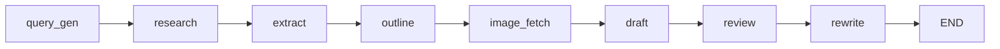
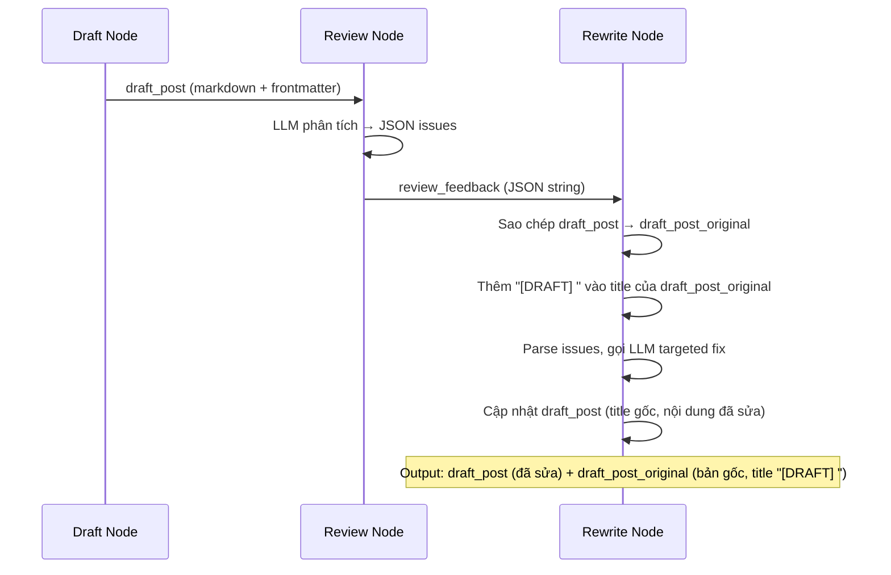

# Tài liệu thiết kế: Vietnamese Naturalness Review

## Tổng quan (Overview)

Feature này thay thế review node hiện tại (scoring-based, 6 tiêu chí, vòng lặp review ⟲ draft) bằng kiến trúc mới gồm 2 node:

1. **Review Node mới** — đánh giá toàn diện bài viết (nội dung + ngôn ngữ tiếng Việt), output là danh sách vấn đề cụ thể dạng JSON có cấu trúc (không scoring)
2. **Rewrite Node mới** — nhận feedback từ review, thực hiện targeted replacements trên bài viết

Pipeline flow thay đổi từ:
```
draft → review ⟲ draft (loop) → END
```
thành:
```
draft → review → rewrite → END
```

Đồng thời dọn dẹp ResearchState (bỏ `review_score`, `review_passed`, `revision_count`) và loại bỏ các tham chiếu đến revision loop trong draft node.

## Kiến trúc (Architecture)

### Pipeline flow mới



### Thay đổi so với kiến trúc hiện tại

| Thành phần | Hiện tại | Sau thay đổi |
|---|---|---|
| `review.py` | Scoring 0-10, 6 tiêu chí, trả về score/passed/feedback | Trả về JSON danh sách issues (không scoring) |
| `rewrite.py` | Không tồn tại | Node mới: targeted replacements dựa trên feedback, lưu bản gốc vào `draft_post_original` với title "[DRAFT] " |
| `graph.py` | Conditional edge `review → draft` (loop) | Linear edge `review → rewrite → END` |
| `state.py` | Có `review_score`, `review_passed`, `revision_count` | Bỏ 3 trường đó, giữ `review_feedback`, thêm `draft_post_original` |
| `draft.py` | Tham chiếu `revision_count`, `review_feedback` cho revision loop | Bỏ logic revision, chỉ viết draft lần đầu |

### Quyết định thiết kế

1. **Không loop**: Một lần review + một lần rewrite là đủ. Loop tạo thêm chi phí LLM mà chất lượng cải thiện không đáng kể sau lần sửa đầu.
2. **Structured JSON feedback**: Review output dạng JSON có cấu trúc để rewrite node có thể parse và áp dụng từng fix. Fallback sang raw text nếu JSON parse thất bại.
3. **Targeted replacement thay vì full rewrite**: Rewrite node yêu cầu LLM chỉ sửa các đoạn có vấn đề, giữ nguyên phần còn lại. Điều này bảo toàn cấu trúc bài viết (frontmatter, heading, hình ảnh).
4. **Gộp review criteria**: Thay vì tách riêng 6 tiêu chí scoring + naturalness check, gộp tất cả vào 1 prompt duy nhất. LLM chỉ cần đọc bài 1 lần và output danh sách issues.

## Thành phần và giao diện (Components and Interfaces)

### 1. Review Node (`pipeline/src/coffee_pipeline/nodes/review.py`)

Thay thế hoàn toàn nội dung hiện tại.

**Input**: `ResearchState` (cần `draft_post`, `topic`)

**Output**: `{"review_feedback": str}` — JSON string chứa danh sách issues

**Hàm chính**:
```python
def review_node(state: ResearchState) -> dict:
    """Đánh giá toàn diện bài viết, trả về danh sách vấn đề cần sửa."""
```

**System prompt** bao gồm 7 khía cạnh đánh giá:
- Factual accuracy (dữ kiện cà phê)
- Tone & style (sáo rỗng AI, thiếu personality, ẩn dụ IT)
- Concision (lặp ý, câu đệm, rườm rà)
- Formatting (YAML frontmatter, markdown)
- Cross-section repetition (luận điểm lặp giữa sections)
- Reference alignment (references khớp nội dung)
- Vietnamese naturalness (văn dịch, cụm từ thụ động, thuật ngữ dịch thô)

**LLM output format** yêu cầu:
```json
{
  "issues": [
    {
      "original": "đoạn văn gốc có vấn đề",
      "category": "naturalness|factual|tone|concision|formatting|repetition|references",
      "suggestion": "gợi ý sửa cụ thể"
    }
  ]
}
```

**Xử lý lỗi**:
- JSON parse thất bại → lưu raw text vào `review_feedback`, log warning
- LLM call thất bại → lưu `review_feedback` rỗng (`""`), log warning
- `PIPELINE_DRY_RUN` → trả về `{"review_feedback": ""}` không gọi LLM

### 2. Rewrite Node (`pipeline/src/coffee_pipeline/nodes/rewrite.py`)

File mới.

**Input**: `ResearchState` (cần `draft_post`, `review_feedback`)

**Output**: `{"draft_post": str, "draft_post_original": str}` — bài viết đã sửa + bản gốc có title "[DRAFT] "

**Hàm chính**:
```python
def rewrite_node(state: ResearchState) -> dict:
    """Sửa bài viết dựa trên review feedback. Targeted replacements, không viết lại toàn bộ."""
```

**Logic**:
1. Sao chép `draft_post` hiện tại thành `draft_post_original`
2. Thêm tiền tố `[DRAFT] ` vào giá trị `title` trong YAML frontmatter của `draft_post_original` (parse frontmatter, prepend "[DRAFT] " vào title, serialize lại)
3. Parse `review_feedback` (JSON string) thành danh sách issues
4. Nếu feedback rỗng hoặc không có issues → trả về `draft_post` nguyên bản + `draft_post_original`, không gọi LLM
5. Gọi LLM với system prompt yêu cầu:
   - Nhận bài viết gốc + danh sách issues
   - Sửa từng issue bằng targeted replacement
   - Giữ nguyên YAML frontmatter (bao gồm title gốc, KHÔNG thêm "[DRAFT] "), heading, hình ảnh (URL + alt text), vị trí ảnh
   - Output là bài viết hoàn chỉnh đã sửa
6. Cập nhật `draft_post` (bài đã sửa, title gốc) và `draft_post_original` (bản gốc, title có "[DRAFT] ") trong state

**Xử lý lỗi**:
- JSON parse feedback thất bại → dùng raw text làm feedback cho LLM (best effort)
- LLM call thất bại → giữ nguyên `draft_post`, vẫn trả về `draft_post_original` với "[DRAFT] " title, log warning
- `PIPELINE_DRY_RUN` → trả về `draft_post` nguyên bản + `draft_post_original` với "[DRAFT] " title

### 3. Graph (`pipeline/src/coffee_pipeline/graph.py`)

**Thay đổi**:
- Import `rewrite_node` từ `nodes.rewrite`
- Thêm node `"rewrite"` vào graph
- Thay conditional edge `review → {draft, END}` bằng linear edges: `review → rewrite`, `rewrite → END`
- Xóa hàm `_review_decision()`

```python
def build_graph():
    graph = StateGraph(ResearchState)
    # ... existing nodes ...
    graph.add_node("review", review_node)
    graph.add_node("rewrite", rewrite_node)
    # ...
    graph.add_edge("draft", "review")
    graph.add_edge("review", "rewrite")
    graph.add_edge("rewrite", END)
    return graph.compile()
```

### 4. State (`pipeline/src/coffee_pipeline/state.py`)

**Bỏ**:
- `review_score: float`
- `review_passed: bool`
- `revision_count: int`

**Giữ**:
- `review_feedback: str` — JSON string từ review node

**Thêm**:
- `draft_post_original: NotRequired[str]` — Bản sao của `draft_post` trước khi rewrite, title có tiền tố "[DRAFT] "

**Thay đổi type**:
- `review_feedback` chuyển thành `NotRequired[str]` vì chỉ được set sau review node
- `draft_post_original` là `NotRequired[str]` vì chỉ được set trong rewrite node

### 5. Draft Node (`pipeline/src/coffee_pipeline/nodes/draft.py`)

**Thay đổi** (dọn dẹp, không thay đổi logic chính):
- Bỏ đọc `review_feedback` và `revision_count` từ state
- Bỏ biến `revision_note` và logic tạo revision feedback block
- Bỏ `revision #{revision_count + 1}` trong log message
- Hàm `draft_node()` chỉ viết draft lần đầu, không có revision logic

### 6. CLI (`pipeline/src/coffee_pipeline/cli.py`)

**Thay đổi trong lệnh `research`**:

#### a. Bỏ scoring khỏi initial_state và summary

- Bỏ `review_score`, `review_passed`, `revision_count` khỏi `initial_state` dict
- Bỏ hiển thị `Score` và `Revisions` trong summary output

#### b. Export 2 file riêng biệt

Sau khi export `draft_post` thành file chính (`{slug}.md`), kiểm tra `draft_post_original` trong `final_state`:

```python
# Export bản nháp gốc nếu tồn tại
draft_original = final_state.get("draft_post_original", "")
if draft_original:
    draft_original = _strip_code_fence(draft_original)
    draft_original_filename = f"{Path(filename).stem}-draft.md"
    try:
        draft_original, orig_localization = localize_markdown_images(
            draft_original, Path(draft_original_filename).stem
        )
    except Exception as e:
        click.secho(f"[WARN] Khong the localize image cho draft original: {e}", fg="yellow", err=True)
        orig_localization = {"rewritten": 0, "downloaded": 0}
    draft_original_path = output_dir / draft_original_filename
    draft_original_path.write_text(draft_original, encoding="utf-8")
    _format_with_prettier(draft_original_path)
```

- Cả 2 file đều qua cùng post-processing: `_strip_code_fence`, `localize_markdown_images`, `_format_with_prettier`
- File draft original dùng slug riêng cho image localization (tránh conflict thư mục ảnh)

#### c. Cập nhật summary output

```python
_echo(f"  File     : {output_path}")
if draft_original_path:
    _echo(f"  Draft    : {draft_original_path}")
```

Bỏ dòng `Score` và `Revisions`, thay bằng đường dẫn file draft nếu có.

#### d. Cập nhật `_save_pipeline_cache`

Thêm lưu `draft_post_original` vào cache:

```python
draft_original = final_state.get("draft_post_original", "")
if draft_original:
    (cache_dir / "draft-original.md").write_text(draft_original, encoding="utf-8")
```

### 7. Test Fixtures (`pipeline/tests/conftest.py`)

**Thay đổi**:
- Bỏ `review_score`, `review_passed`, `revision_count` khỏi `sample_state`

## Mô hình dữ liệu (Data Models)

### ResearchState (sau thay đổi)

```python
class ResearchState(TypedDict):
    topic: str
    category: str
    search_queries: NotRequired[list[str]]
    search_results: list[dict]
    extracted_docs: list[dict]
    article_outline: NotRequired[dict]
    article_images: NotRequired[list[dict]]
    draft_post: str
    draft_post_original: NotRequired[str]  # Bản nháp gốc (trước rewrite), title có "[DRAFT] "
    review_feedback: NotRequired[str]  # JSON string từ review node
```

### Review Feedback JSON Schema

```json
{
  "issues": [
    {
      "original": "string — đoạn văn gốc có vấn đề (trích nguyên văn từ bài viết)",
      "category": "string — một trong: naturalness, factual, tone, concision, formatting, repetition, references",
      "suggestion": "string — gợi ý sửa cụ thể, có thể là đoạn văn thay thế hoặc hướng dẫn sửa"
    }
  ]
}
```

Khi không có vấn đề nào: `{"issues": []}` hoặc feedback rỗng `""`.

### Luồng dữ liệu qua pipeline (phần thay đổi)




## Correctness Properties

*Một property là một đặc tính hoặc hành vi phải luôn đúng trong mọi lần thực thi hợp lệ của hệ thống — về bản chất là một phát biểu hình thức về những gì hệ thống phải làm. Properties đóng vai trò cầu nối giữa đặc tả dễ đọc cho con người và đảm bảo tính đúng đắn có thể kiểm chứng bằng máy.*

### Property 1: Review output có cấu trúc hợp lệ

*For any* valid JSON response từ LLM chứa danh sách issues, review node phải trả về `review_feedback` là một JSON string mà khi parse ra, mỗi issue đều có đủ 3 trường: `original` (string), `category` (string thuộc tập hợp hợp lệ), và `suggestion` (string).

**Validates: Requirements 1.3, 2.1**

### Property 2: Review output không chứa scoring

*For any* input state có `draft_post` và `topic`, output của review node không bao giờ chứa các key `review_score`, `review_passed`, hoặc `revision_count`.

**Validates: Requirements 1.4**

### Property 3: Review fallback khi JSON không hợp lệ

*For any* non-JSON string trả về từ LLM (bất kỳ chuỗi ký tự nào không parse được thành JSON hợp lệ), review node phải lưu toàn bộ raw text đó vào `review_feedback` thay vì raise exception.

**Validates: Requirements 2.2**

### Property 4: Rewrite bảo toàn cấu trúc bài viết

*For any* bài viết có YAML frontmatter, headings (##/###), và hình ảnh (markdown image syntax), và *for any* danh sách review issues, sau khi rewrite node xử lý, bài viết output phải giữ nguyên: (a) toàn bộ YAML frontmatter, (b) tất cả headings và thứ tự của chúng, (c) tất cả image URLs và alt text.

**Validates: Requirements 4.1, 4.2, 4.3**

### Property 5: Rewrite với feedback rỗng giữ nguyên bài viết

*For any* bài viết (`draft_post`), khi `review_feedback` rỗng (`""`) hoặc là JSON với danh sách issues rỗng (`{"issues": []}`), rewrite node phải trả về `draft_post` giống hệt bản gốc mà không gọi LLM.

**Validates: Requirements 4.4**

### Property 6: Rewrite tạo draft_post_original với title "[DRAFT] " và draft_post giữ title gốc

*For any* bài viết có YAML frontmatter chứa `title`, sau khi rewrite node xử lý, (a) `draft_post_original` phải tồn tại và chứa nội dung bài viết gốc trước khi sửa, (b) `title` trong YAML frontmatter của `draft_post_original` phải bắt đầu bằng `[DRAFT] `, và (c) `title` trong YAML frontmatter của `draft_post` (bài đã sửa) KHÔNG được bắt đầu bằng `[DRAFT] `.

**Validates: Requirements 3.5, 3.6, 3.7**

### Property 7: CLI export 2 file khi draft_post_original tồn tại

*For any* `final_state` chứa cả `draft_post` (non-empty) và `draft_post_original` (non-empty), CLI lệnh `research` phải tạo ra 2 file: file chính `{slug}.md` từ `draft_post` và file `{slug}-draft.md` từ `draft_post_original`. Khi `draft_post_original` rỗng hoặc không tồn tại, chỉ tạo file chính.

**Validates: Requirements 7.1, 7.2, 7.5**

## Xử lý lỗi (Error Handling)

### Review Node

| Tình huống | Xử lý |
|---|---|
| LLM trả về JSON hợp lệ | Parse JSON, lưu vào `review_feedback` |
| LLM trả về JSON không hợp lệ | Lưu raw text vào `review_feedback`, log warning `[Review] JSON parse failed, using raw text` |
| LLM call thất bại (network, timeout, exception) | Lưu `review_feedback = ""`, log warning `[Review] LLM call failed: {error}` |
| `PIPELINE_DRY_RUN` được bật | Trả về `{"review_feedback": ""}`, không gọi LLM |

### Rewrite Node

| Tình huống | Xử lý |
|---|---|
| `review_feedback` rỗng hoặc `{"issues": []}` | Sao chép `draft_post` → `draft_post_original` (thêm "[DRAFT] " vào title), trả về `draft_post` nguyên bản, không gọi LLM |
| `review_feedback` là JSON hợp lệ có issues | Sao chép `draft_post` → `draft_post_original` (thêm "[DRAFT] " vào title), parse issues, gọi LLM để sửa, cập nhật `draft_post` |
| `review_feedback` là raw text (không phải JSON) | Sao chép `draft_post` → `draft_post_original` (thêm "[DRAFT] " vào title), dùng raw text làm feedback cho LLM (best effort) |
| LLM call thất bại | Giữ nguyên `draft_post`, vẫn trả về `draft_post_original` với "[DRAFT] " title, log warning `[Rewrite] LLM call failed: {error}` |
| `PIPELINE_DRY_RUN` được bật | Sao chép `draft_post` → `draft_post_original` (thêm "[DRAFT] " vào title), trả về `draft_post` nguyên bản |

### Draft Node (dọn dẹp)

Bỏ toàn bộ logic liên quan đến revision:
- Không đọc `review_feedback` hay `revision_count` từ state
- Không tạo `revision_note`
- Log message không còn `revision #`

### CLI (`pipeline/src/coffee_pipeline/cli.py`)

| Tình huống | Xử lý |
|---|---|
| `draft_post_original` tồn tại và non-empty | Export thành `{slug}-draft.md`, áp dụng cùng post-processing |
| `draft_post_original` rỗng hoặc không tồn tại | Chỉ export `draft_post`, không tạo file `-draft` |
| Image localization thất bại cho draft original | Log warning, vẫn export file (không localize), tiếp tục pipeline |

## Chiến lược kiểm thử (Testing Strategy)

### Thư viện

- **Unit tests**: `pytest` (đã có trong project)
- **Property-based tests**: `hypothesis` (đã có trong `dev` dependencies)
- Mỗi property test chạy tối thiểu 100 iterations

### Property-Based Tests

Mỗi correctness property ở trên được implement bằng đúng 1 property-based test:

1. **Feature: vietnamese-naturalness-review, Property 1: Review output có cấu trúc hợp lệ**
   - Generator: tạo random JSON objects có dạng `{"issues": [{"original": str, "category": str, "suggestion": str}, ...]}` với số lượng issues ngẫu nhiên (0-10)
   - Mock `call_llm` trả về JSON string đã generate
   - Assert: review node output `review_feedback` khi parse ra, mỗi issue có đủ `original`, `category`, `suggestion`

2. **Feature: vietnamese-naturalness-review, Property 2: Review output không chứa scoring**
   - Generator: tạo random `draft_post` (string) và `topic` (string)
   - Mock `call_llm` trả về valid JSON issues
   - Assert: output dict không chứa keys `review_score`, `review_passed`, `revision_count`

3. **Feature: vietnamese-naturalness-review, Property 3: Review fallback khi JSON không hợp lệ**
   - Generator: tạo random strings không phải JSON hợp lệ (dùng `st.text().filter(lambda s: not is_valid_json(s))`)
   - Mock `call_llm` trả về string đã generate
   - Assert: review node không raise exception, `review_feedback` chứa raw text

4. **Feature: vietnamese-naturalness-review, Property 4: Rewrite bảo toàn cấu trúc bài viết**
   - Generator: tạo random draft có frontmatter (YAML giữa `---`), headings (`## ...`), và images (``)
   - Generator: tạo random review issues
   - Mock `call_llm` trả về bài viết đã sửa (giữ nguyên structure, thay đổi body text)
   - Assert: frontmatter trước/sau giống nhau, headings trước/sau giống nhau (cùng thứ tự), image URLs trước/sau giống nhau

5. **Feature: vietnamese-naturalness-review, Property 5: Rewrite với feedback rỗng giữ nguyên bài viết**
   - Generator: tạo random `draft_post` (string có frontmatter)
   - Input: `review_feedback` là `""` hoặc `'{"issues": []}'`
   - Assert: output `draft_post` === input `draft_post`, không gọi `call_llm`

6. **Feature: vietnamese-naturalness-review, Property 6: Rewrite tạo draft_post_original với title "[DRAFT] " và draft_post giữ title gốc**
   - Generator: tạo random `draft_post` có YAML frontmatter chứa `title` (random string không bắt đầu bằng "[DRAFT] ")
   - Generator: tạo random review issues (có thể rỗng hoặc có issues)
   - Mock `call_llm` trả về bài viết đã sửa (giữ nguyên title gốc)
   - Assert: (a) output chứa `draft_post_original`, (b) title trong frontmatter của `draft_post_original` bắt đầu bằng `[DRAFT] `, (c) title trong frontmatter của `draft_post` KHÔNG bắt đầu bằng `[DRAFT] `

7. **Feature: vietnamese-naturalness-review, Property 7: CLI export 2 file khi draft_post_original tồn tại**
   - Generator: tạo random `draft_post` và `draft_post_original` (cả hai có YAML frontmatter hợp lệ)
   - Mock `graph.invoke` trả về final_state chứa cả 2 trường
   - Assert: (a) file `{slug}.md` được tạo từ `draft_post`, (b) file `{slug}-draft.md` được tạo từ `draft_post_original`
   - Variant: khi `draft_post_original` rỗng → chỉ tạo file chính, không tạo file `-draft`

### Unit Tests (Examples & Edge Cases)

- **Review dry-run**: Set `PIPELINE_DRY_RUN`, verify empty feedback, no LLM call
- **Review LLM exception**: Mock `call_llm` raise exception, verify empty feedback
- **Rewrite dry-run**: Set `PIPELINE_DRY_RUN`, verify draft unchanged, verify `draft_post_original` có title "[DRAFT] "
- **Rewrite dry-run tạo draft_post_original**: Set `PIPELINE_DRY_RUN`, verify `draft_post_original` tồn tại và title bắt đầu bằng "[DRAFT] "
- **Graph topology**: Verify compiled graph has edges `draft→review→rewrite→END`, no conditional edge from review to draft
- **State structure**: Verify `ResearchState` annotations don't contain `review_score`, `review_passed`, `revision_count`; do contain `review_feedback` và `draft_post_original`
- **Draft node cleanup**: Verify `draft_node` doesn't reference `revision_count` or `review_feedback` from state
- **CLI dual export**: Mock `graph.invoke` trả về final_state có `draft_post_original`, verify 2 file được tạo
- **CLI single export**: Mock `graph.invoke` trả về final_state không có `draft_post_original`, verify chỉ 1 file được tạo
- **CLI summary không có scoring**: Verify output không chứa `Score` hay `Revisions`
- **CLI cache lưu draft-original.md**: Verify `_save_pipeline_cache` lưu `draft_post_original` thành `draft-original.md`
